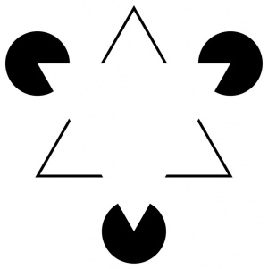

A Cyberpunk Manifesto (Transceiverfreq, 2011)
=============================================

*August 20, 2011*

"Information is information, not matter or energy."

.- Norbert Wiener

The Kanisza Triangle
--------------------

Created in 1976-79 by Gaetano Kanizsa, Italian psychologist and artist,
founder of the Institute of Psychology of Trieste. An optical illusion,
comprised of three black circles with equal wedges cut out of them
facing the center point and three black angles on a white background.
The illusory contours defined by these shapes creates a white triangle
in the liminal negative space. This is a metaphor for "cyberspace" in
that it is defined by illusory boundaries and yet is intangible.

The "idea" of the triangle exists. But in actuality it is defined by
the interaction of the shapes and our mind's perception. This is the
simplest symbol as yet I have found to describe "cyberspace".

READ
----

-   Wikipedia - Cybernetics.
-   The Human Use of Human Beings - Norbert Wiener, 1948.
-   Cybernetics: Or the Control and Communication in the Animal and the
    Machine - Norbert Wiener, 1950.
-   Does Technology Drive History? The Dilemma of Technological
    Determinism - Merritt Roe Smith, Leo Marx, 1994.
-   Human-Built World: How to Think about Technology and Culture -
    Thomas P. Hughes, 2004.
-   Cyberspace: First Steps - Michael Benedikt, 1991.
-   Neuromancer - William Gibson.
-   Fear of Knowledge: Against Relativism and Constructivism - Paul
    Boghossian, 2006.
-   Cyborg: Digital Destiny and Human Possibility in the Age of the
    Wearable Computer - Steve Mann, 2001.
-   Simulacra and Simulation - Jean Baudrillard, 1981.

WE ASSERT:
----------

-   information "wants to be free" and should be free.
-   information raises quality of living.
-   information maturates autonomy.
-   not only does information "want to be free" but has an unstoppable
    and natural proclivity to become free.
-   information will maintain it's own freedom by means of inaction or
    action of liberation by external forces.
-   all previous wars are based partially if not entirely in the
    exchange of, suppression of or discovery of many forms of
    information.
-   necessity breeds invention and the world has a dire necessity for
    change.
-   the human/machine network is the victory of information.
-   the internet is at the same anational and a nation unto itself.
-   cyberspace exists between the nodes of the network. It is the
    meta-space defined by the exchange of information between users.
-   the internet defines cyberspace by it's own expanding and mutable
    boundaries.
-   the movements of cyberspace encroach on meatspace. In this way the
    net is always moving into the real world.
-   the world is constantly in a state of revolution.
-   the web is the world.

WE:
---

-   are native to the net.
-   are linked in anonymity and justified in it daily.
-   are the network itself. It is defined by our action and inaction.
-   are without a born nation and free as such.
-   expect more from our generation than the ones before us.
-   choose freedom as our nationality and stand alone nodality as our
    native language.
-   choose speed as our method and flux as our driving force.
-   reject governance, nations, religion and corporate entities. we
    reject their stranglehold on the human mind and condition.
-   believe "the street" defines it's own use for technology.
-   believe there is no such thing as too much information.
-   believe all should have access to the network and the data.
-   believe access to computing devices - and anything that teaches
    something about the way the world works - should be unlimited.
-   stand against established forms of hierarchies and promote
    decentralization.
-   promote the exceeding of limitations both personal and shared.
-   are the technology. the internet is made of meat.
-   are not the dejected teenage rebels described by our forebears.
-   do not define ourselves by the technology we use but what we use it
    for.
-   believe in the burning presence of the future.

ADVICE (Ø):
-----------

-   when they call it "paradox", they're hiding the oxygen.
-   there's a special quality in a good translation that can never be
    captured in the original.
-   travel light, stay alert and eat what you kill.
-   always look at the underside first.
-   when you find truth, pass it on, quick, before they bury it under
    money.
-   "the revolution" devours it's young.
-   to contact a human opereator, press "0".
